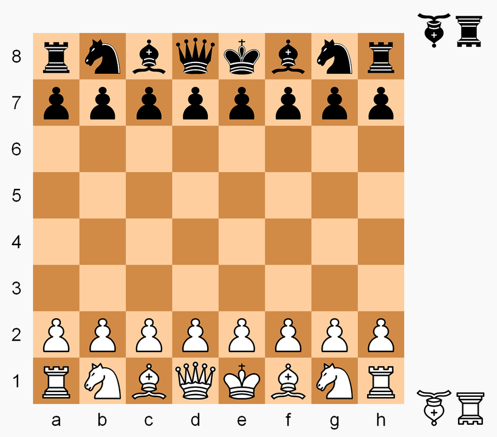

# portfolio-project

**Remember that this project cannot be submitted late.**

Write a class named **ChessVar** for playing an abstract board game that is a variant of chess. The following explanation of the rules assumes some familiarity with the rules of chess - specifically how the pieces move and capture. If you have any questions about those rules, please don't hesitate to ask.

The starting position for the game is the normal starting position for standard chess. You will need to keep track of which player's turn it is. As in standard chess, white moves first. Pieces move and capture the same as in standard chess, except that **there is no check or checkmate, and there is no castling, en passant, or pawn promotion**. As in standard chess, each pawn should be able to move two spaces forward on its first move (but not on subsequent moves). 

If a player's king is captured, the game ends, and that player loses. 

Locations on the board will be specified using "algebraic notation", with columns labeled a-h and rows labeled 1-8, as shown in this diagram:



Special rules for this variant of chess:

Each of the players in the reserve has one piece of the **Falcon** and the **Hunter**.

Falcon: moves forward like a bishop, and backward like a rook

Hunter: moves forward like a rook and backward like a bishop

The falcon and hunter start the game off the board and out of play (see diagram). Once a player loses their queen, a rook, a bishop, or a knight, they may, on any subsequent move, enter their falcon or hunter into play on any **empty square of their two home ranks**. Doing so constitutes a turn. The player becomes eligible to enter their remaining fairy piece (falcon or hunter) after losing a second piece (queen, rook, bishop, or knight)(could be anytime after losing the first piece, don’t need to be losing after entering the first fairy piece). https://www.chess.com/blog/Pokshtya/falcon-hunter-chess
https://en.wikipedia.org/wiki/Falcon%E2%80%93hunter_chess

Your ChessVar class must include the following:
* An **init method** that initializes any data members
* A method called **get_game_state** that just returns 'UNFINISHED', 'WHITE_WON', 'BLACK_WON'. 
* A method called **make_move** that takes two parameters - strings that represent the square moved from and the square moved to.  For example, make_move('b2', 'b4').  If the square being moved from does not contain a piece belonging to the player whose turn it is, or if the indicated move is not legal, or if the game has already been won, then it should **just return False**.  Otherwise it should make the indicated move, remove any captured piece, update the game state if necessary, update whose turn it is, and return True.
* A method called **enter_fairy_piece** that takes two parameters - strings that represent the type of the piece (white falcon 'F', white hunter 'H', black falcon 'f', black hunter 'h') and the square it will enter. For example, enter_fairy_piece ('H', 'c1'). If the fairy piece is not allowed to enter this position at this turn for any reason, it should **just return False**.  Otherwise it should enter the board at that position, update whose turn it is, and return True.

You're not required to have a function that prints the board, but you will probably find it very useful for testing purposes.

Feel free to add whatever other classes, methods, or data members you want.  All data members of a class must be private.  Every class should have an init method that initializes all of the data members for that class.

Here's a very simple example of how the class could be used:
```
game = ChessVar()
move_result = game.make_move('c2', 'c4')
game.make_move('g7', 'g5')
state = game.get_game_state()
```
```
The file must be named: **ChessVar.py**
